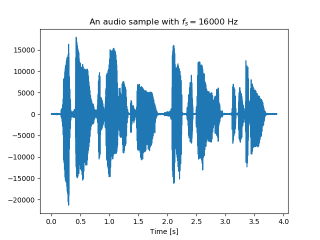

第1章：オーディオファイル読み込み・サンプルレート・ビットレート・録音・再生・サンプルレート変換
-----------------------------------------------------------------------------------------------

1. オーディオファイル`../data/cmu_arctic_us_aew_a0001.wav`を読み込んで、時間領域のオーディオをプロットする。
  横軸の時間のユニットを「秒」にする。
  サンプリング周波数をプリントする。次は`../data/piano2.wav`で演習を繰り返す。
  
  サンプリング周波数と、ビットフォーマットと、チャンネル数をプリントする。

2. 440ヘルツ波を再生する。再生するために[`sounddevice`](https://python-sounddevice.readthedocs.io)パイソンパッケージを利用する。

3. `wav` ファイルを読み込んで、再生する

4. 音を録音して、`wav`ファイルに落とす

5. 音を録音し、そのまま再生する（パススルー）

6. 440ヘルツのなみを16ビット`wav`ファイルに落とす

7. 今回は２チャンネルのファイルを作成する。チャンネル１とチャンネル２は5ヘルツの差の波。wavファイルに落とす。

8. `../data/cmu_arctic_us_aew_a0001.wav`を読み込んで、サンプリング周波数を8kHzに落とす。
  サンプリング周波数変換には[`samplerate`](https://python-samplerate.readthedocs.io)パイソンパッケージを利用する。

9.

10.
